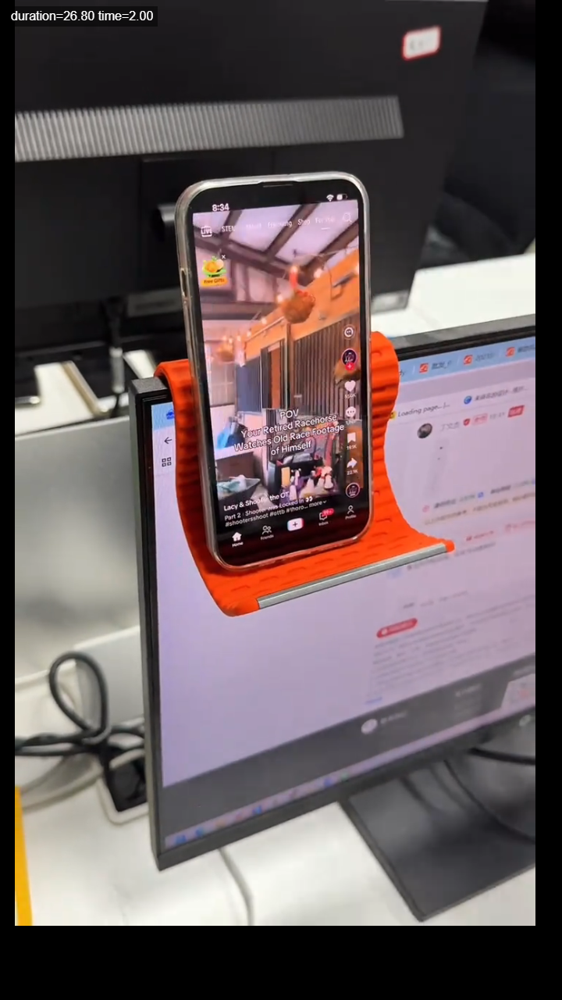
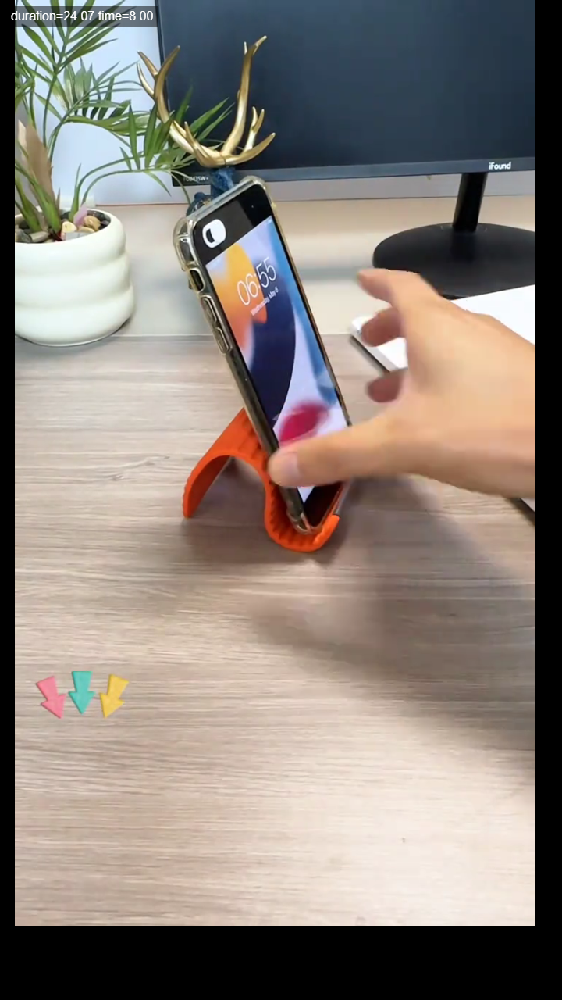
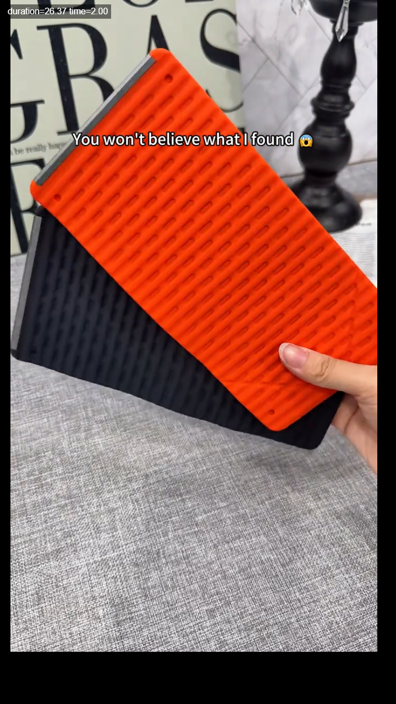
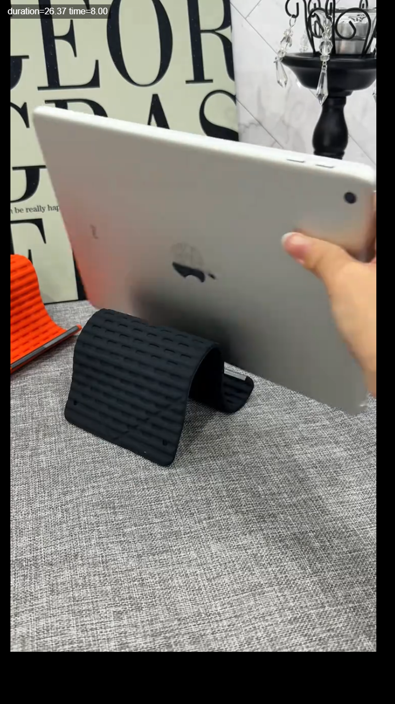
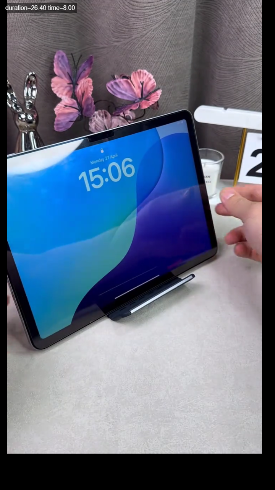
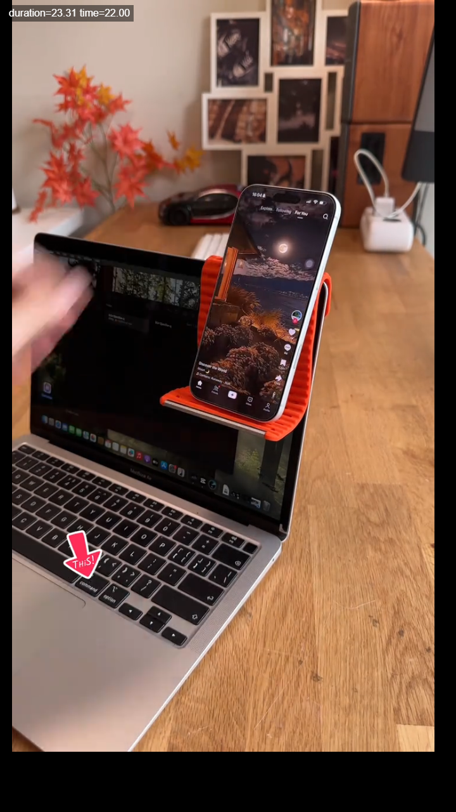

# TikTok Shop Creator Collaboration Brief

## Product

Flexible Silicone Aluminum Phone Holder Stand  
Product type: bendable silicone-and-aluminum phone/tablet holder  
Content angle: desk setup upgrade, hands-free phone use, bendable demo, phone + tablet support.

## Campaign Goal

Create a natural creator-style video that shows the result in the first 3 seconds: the phone stays beside the screen, hands-free. Keep the tone casual, useful, and lightly surprised.

## Main Selling Points

1. Bendable design: shape it into different angles for a monitor-side holder or desk stand.
2. Keeps the phone in view: useful while working, scrolling, checking messages, filming, or FaceTiming.
3. Works for phone and tablet: show both use cases if possible.
4. Portable and easy to store: can be folded or rolled up for desk, bedside, office, or travel use.
5. Easy to understand visually: show how to bend it and place the phone inside so viewers instantly get it.

## Recommended Video Structure

0-3 seconds: Show the result first. Phone is already held beside the monitor or laptop.  
3-8 seconds: Show how the stand bends and how the phone is placed into it.  
8-15 seconds: Show stable phone use, then cut to tablet or another desk use case.  
15-22 seconds: Show how it fits everyday routines: work, scrolling, video calls, filming.  
Final 3-5 seconds: Return to the clean desk setup and include a simple shopping cart CTA.

## Hooks + Matching Visuals

### Hook 1

Voiceover: Stop looking down at your phone every time you work.

Best visual: phone already held beside a monitor or laptop.

Why it works: directly hits the desk-work pain point and makes the product useful within the first second.

### Hook 2

Voiceover: I thought this was just a simple silicone strip, until I bent it like this.

Best visual: hands bending the stand, then placing the phone into it.

Why it works: creates curiosity and immediately explains the bendable feature.

### Hook 3

Voiceover: You won’t get it until you see how it holds your phone.

Best visual: product close-up, then quickly cut to the phone or tablet being supported.

Why it works: good curiosity hook, but the use case must appear within 1-2 seconds.

## Mid-Video Demonstration

### Bend and Place Demo

Voiceover direction: You just bend it into the shape you need, and it turns into a phone stand in seconds.

Best visual: hands bending the stand and placing the phone into it.

Purpose: reduces setup confusion and shows viewers exactly how to use it.

### Tablet Support Demo

Voiceover direction: It is not only for phones. It can also hold a tablet for watching, reading, or video calls.

Best visual: tablet supported by the stand on a table.

Purpose: makes the product feel more useful and not limited to one device.

## CTA Options

Use one CTA only. Keep it short and natural:

1. Tap the shopping cart and try it for your desk setup.
2. Click the product link and keep one on your desk.
3. Add it to your cart if your phone is always in the wrong spot.
4. Tap the cart and see how much easier this makes your setup.
5. Grab one and stop propping your phone against random things.

Best final visual: return to the finished desk setup, with the phone stable beside the screen. A hand gesture toward the product or cart area works well.

## Reference Voiceover

Stop looking down at your phone every time you work. This little bendable stand keeps your phone right next to your screen, so you can scroll, check messages, film, or FaceTime hands-free. Just bend it into the shape you need, place your phone in, and you are set. It can even work for a tablet. Tap the shopping cart and try it for your desk setup.

## Do

- Show the result in the first 3 seconds.
- Show hands bending the stand and placing the phone inside.
- Make the video feel like a real creator recommendation.
- Show both phone and tablet if possible.
- End on a clean, stable desk setup.

## Avoid

- Do not start with packaging.
- Do not spend the first seconds explaining the product name.
- Do not make medical claims such as neck pain relief or posture correction.
- Do not say "never falls," "100% anti-slip," or exaggerated strength claims.
- Do not show shaky tablet or phone support.
